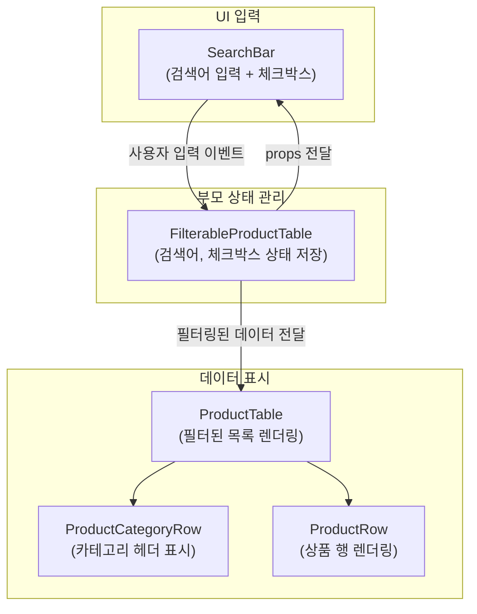

# Thinking in React

# 학습 내용 리뷰
<!--  -->





## Installation


### HTML page

```html
<!DOCTYPE html>
<html>
  <head>
    <meta charset="UTF-8" />
    <title>Hello World</title>
    <script src="https://unpkg.com/react@18/umd/react.development.js"></script>
    <script src="https://unpkg.com/react-dom@18/umd/react-dom.development.js"></script>

    <!-- Don't use this in production: -->
    <script src="https://unpkg.com/@babel/standalone/babel.min.js"></script>
  </head>
  <body>
    <div id="root"></div>
    <script type="text/babel">
    
      function MyApp() {
        return <h1>Hello, world!</h1>;
      }

      const container = document.getElementById('root');
      const root = ReactDOM.createRoot(container);
      root.render(<MyApp />);
    </script>
  </body>
</html>
```