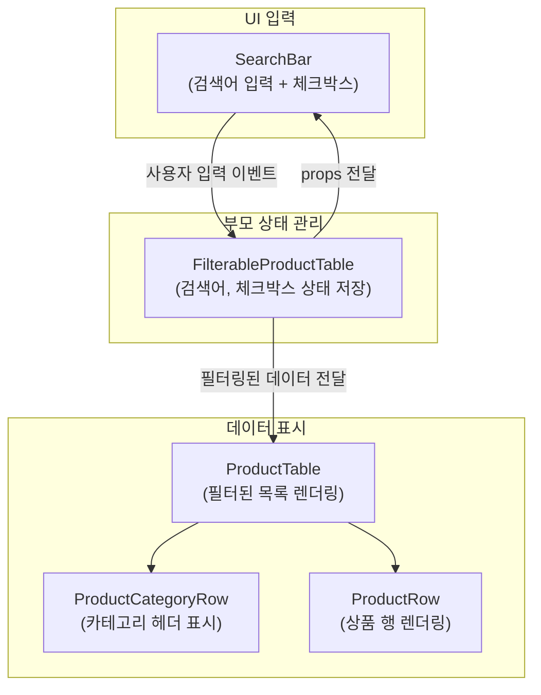

# Thinking in React

# 학습 내용 리뷰
<!--  -->

## Step 1: Break the UI into a component hierarchy 
디자인(혹은 마크업)을 보고 시각적으로 반복되는 패턴을 컴포넌트 단위로 쪼갬.
- 한 가지 역할만 담당하도록 분리하며, 컴포넌트는 재사용 가능한 최소 단위가 됨.
- 예: FilterableProductTable → SearchBar와 ProductTable로 나누고, 다시 ProductRow, ProductCategoryRow 등으로 세분화

> DOM 구조가 아닌 **관심사의 분리(Separation of Concerns)**에 따라 컴포넌트를 나누는 습관

## Step 2: Build a static version in React 
- 상태를 사용하지 않고, 더미 데이터로 UI 구조를 먼저 구현.
- 이 단계에서는 상태 관리 없이 props를 통해 데이터만 전달.

> 상태 없이 컴포넌트만으로 UI를 구성해보며 **하향식 데이터 흐름(Top-down data flow)**을 경험

## Step 3: Find the minimal but complete representation of UI state 
UI에 필요한 최소한의 상태(State)를 식별

- 어떤 데이터를 상태로 관리해야 하는지 선별
- 다음 세 가지 질문을 통해 판단:
  1. 부모로부터 props로 전달되는가?
  2. 시간이 지나도 변하지 않는 값인가?
  3. 컴포넌트 안의 다른 state나 props를 가지고 계산 가능한가?

> 불필요한 상태를 만들지 않는 습관을 들이고, 어떤 데이터를 상태로 올릴지를 판단하는 경험을 학습해야 함

## Step 4: Identify where your state should live 
상태를 적절한 컴포넌트로 올린다

- 여러 컴포넌트가 공유해야 하는 상태는 공통 부모 컴포넌트로 끌어올린다.
- 이 과정에서 상태를 가진 컴포넌트와 상태를 사용하는 컴포넌트 간의 관계가 생김.

> 컴포넌트 간 데이터 흐름을 효율적으로 설계하고, 하향식 데이터 흐름과 상향식 이벤트 전달을 이해

## Step 5: Add inverse data flow 
반대 방향의 데이터 흐름을 추가

> 지금까지 계층 구조 아래로 흐르는 props와 state의 함수를 활용하여 앱을 만들었는데, 이제는 사용자 입력에 따라 state를 변경하려면 반대 방향의 데이터 흐름을 만들어야 함

- 사용자의 입력을 받아 상태를 갱신하는 흐름을 구성.
- 자식 컴포넌트에서 이벤트를 발생시켜 부모의 상태를 변경하고, 변경된 상태가 다시 자식에게 전달되는 구조.

> 이벤트 핸들링과 상태 업데이트 흐름을 분리하고, **단방향 데이터 흐름(One-way data flow)**을 기반으로 시스템을 설계 
> 💡 (React는 데이터 흐름을 명시적으로 보이게 만들어 줍니다. 그러나 이는 전통적인 양방향 데이터 바인딩보다 조금 더 많은 타이핑이 필요합니다)

## 데이터 플로우 다이어그램

